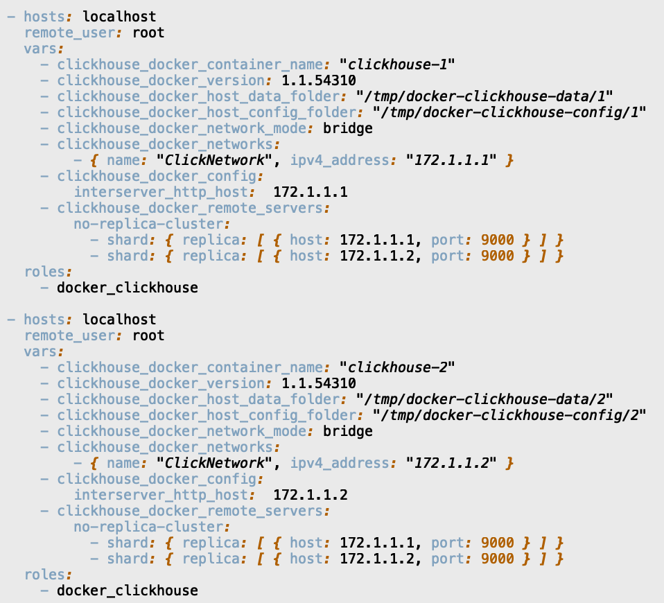
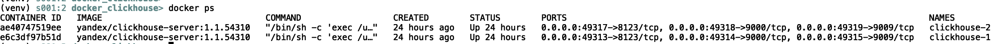
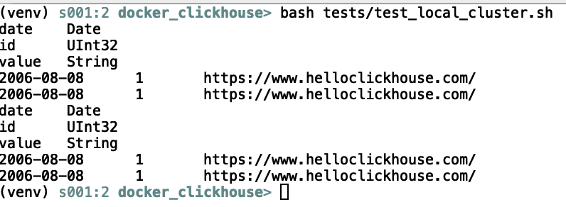
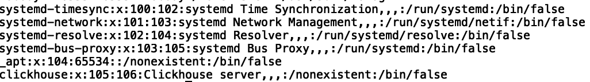
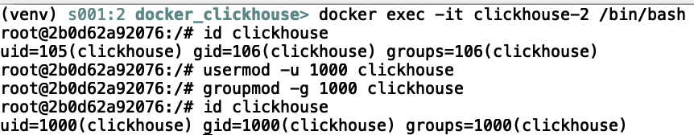

1) ClickHouse in Docker: 2 shards, 2 instances:
    - I won't re-invent the weel, so have taken already written role from ansible-galaxy as template.
      https://galaxy.ansible.com/searchmetrics/ansible-role-docker-clickhouse

    - Ansible play `test_local_cluster.yml` creates docker network with 2 clickhouse nodes
      

    - `docker ps` command prints created containers: "clockhouse-1", "clockhouse-2".
      

    - `tests/test_local_cluster.sh` tests created ClickHouse instances:
      creates table, inserts some data into it and prints results to stdout.
      

2) uid/gid -> 100:1000
    - uid 100 already busy with `systemd-timesync` service user:
      

    - to change `clickhouse` user UID/GID, for example, to 1000:1000, it
      is possible to run a container as a root and change IDs within
      `usermod`, `groupmod` commands:
      

3) Molecule test:
    - init test suite for existing role `molecule init scenario -r docker_clickhouse`
    - run comlete loop of default tests with `molecule test`

tested on:
MacOS BigSur 11.4: Darwin Kernel Version 20.5.0,
Python 3.9.5,
Docker version 20.10.7
